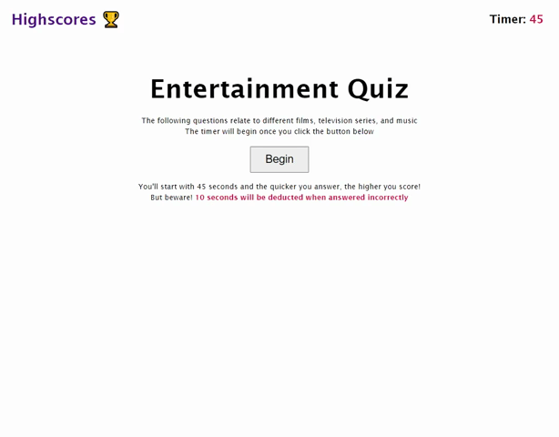

# Entertainment Code Quiz

## Description

This project contains an interactive quiz application, related to entertainment, that is timed. The user must answer these questions as quick as possible, receiving a penalty for each wrong answer. The remaining time will be the user's score, which is locally stored and displayed on the highscores page.

## Installation

Using git bash (Windows) or terminal (MacOS):

1. Download ZIP found under `<> Code` and run the repo to open into VS Code  
OR clone the repo using `git clone git@github.com:pljon/entertainment-coding-quiz.git`
2. Path to repo's location on local machine using `cd`
3. Open repo on VS code using `code .` to begin working on it locally

## Remote Link

This link reflects the current source code found in this repo:

https://pljon.github.io/Refactor-SEO/

## Screenshot

